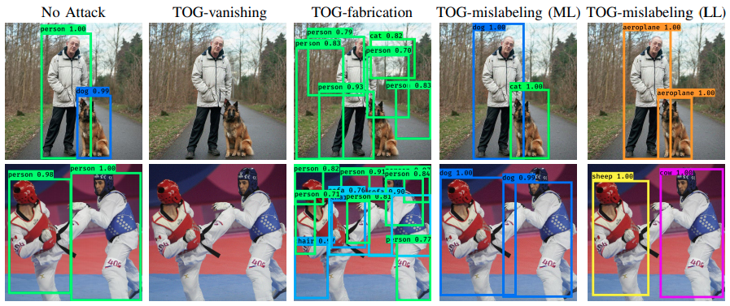

## Introduction


Real-time object detection is one of the key applications of deep neural networks (DNNs) for real-world mission-critical systems. While DNN-powered object detection systems celebrate many life-enriching opportunities, they also open doors for misuse and abuse. This project presents a suite of adversarial objectness gradient attacks, coined as TOG, which can cause the state-of-the-art deep object detection networks to suffer from untargeted random attacks or even targeted attacks with three types of specificity: (1) object-vanishing, (2) object-fabrication, and (3) object-mislabeling. Apart from tailoring an adversarial perturbation for each input image, we further demonstrate TOG as a universal attack, which trains a single adversarial perturbation that can be generalized to effectively craft an unseen input with a negligible attack time cost. Also, we apply TOG as an adversarial patch attack, a form of physical attacks, showing its ability to optimize a visually confined patch filled with malicious patterns, deceiving well-trained object detectors to misbehave purposefully. 

| No Attack | TOG-vanishing | TOG-fabrication | TOG-mislabeling |
|:---------:|:-------------:|:---------------:|-----------------|
|||||

This repository contains the source code for the following papers in our lab:
* Ka-Ho Chow, Ling Liu, Margaret Loper, Juhyun Bae, Mehmet Emre Gursoy, Stacey Truex, Wenqi Wei, and Yanzhao Wu. "Adversarial Objectness Gradient Attacks in Real-time Object Detection Systems." In IEEE International Conference on Trust, Privacy and Security in Intelligent Systems, and Applications, 2020. [[PDF]](https://khchow.com/media/arXiv_TOG.pdf) [[Talk]](http://www.youtube.com/watch?v=acWI5pFNvwg)
* Ka-Ho Chow, Ling Liu, Mehmet Emre Gursoy, Stacey Truex, Wenqi Wei, and Yanzhao Wu. "Understanding Object Detection Through an Adversarial Lens." In European Symposium on Research in Computer Security, pp. 460-481. Springer, 2020. [[PDF]](https://arxiv.org/pdf/2007.05828.pdf) [[Talk]](http://www.youtube.com/watch?v=acWI5pFNvwg)


## Installation and Dependencies
This project runs on Python 3.6. You are highly recommended to create a virtual environment to make sure the dependencies do not interfere with your current programming environment. By default, GPUs will be used to accelerate the process of adversarial attacks. 

To install related packages, run the following command in terminal:
```bash
pip install -r requirements.txt
```

## Instruction
TOG attacks support both one-phase and two-phase object detectors. In this repository, we include five object detectors trained on the VOC dataset. We prepare a Jupyter notebook for each victim detector to demonstrate the TOG attacks. Pretrained weights are available for download, and the links are provided in the corresponding notebook.
* YOLOv3 with Darknet53: [[link]](https://github.com/git-disl/TOG/blob/master/demo_yolov3-d.ipynb)
* YOLOv3 with MobileNetV1: [[link]](https://github.com/git-disl/TOG/blob/master/demo_yolov3-m.ipynb)
* SSD300 with VGG16: [[link]](https://github.com/git-disl/TOG/blob/master/demo_ssd300.ipynb)
* SSD512 with VGG16: [[link]](https://github.com/git-disl/TOG/blob/master/demo_ssd512.ipynb)
* Faster R-CNN with VGG16: [[link]](https://github.com/git-disl/TOG/blob/master/demo_frcnn.ipynb)

We also provide a notebook [[link]](https://github.com/git-disl/TOG/blob/master/demo_patch.ipynb) demonstrating how to generate adversarial patches using TOG with vanishing and mislabeling effects.

## Status
We are continuing the development and there is ongoing work in our lab regarding adversarial attacks and defenses on object detection. If you would like to contribute to this project, please contact [Ka-Ho Chow](https://khchow.com). 

The code is provided as is, without warranty or support. If you use our code, please cite:
```
@inproceedings{chow2020adversarial,
  title={Adversarial Objectness Gradient Attacks in Real-time Object Detection Systems},
  author={Chow, Ka-Ho and Liu, Ling and Loper, Margaret and Bae, Juhyun and Emre Gursoy, Mehmet and Truex, Stacey and Wei, Wenqi and Wu, Yanzhao},
  booktitle={IEEE International Conference on Trust, Privacy and Security in Intelligent Systems, and Applications},
  pages={263--272},
  year={2020},
  organization={IEEE}
}
```

```
@inproceedings{chow2020understanding,
  title={Understanding Object Detection Through an Adversarial Lens},
  author={Chow, Ka-Ho and Liu, Ling and Gursoy, Mehmet Emre and Truex, Stacey and Wei, Wenqi and Wu, Yanzhao},
  booktitle={European Symposium on Research in Computer Security},
  pages={460--481},
  year={2020},
  organization={Springer}
}
```

Our lab also investigates robust object detection against adversarial attacks, you can refer to:
```
@inproceedings{chow2021robust,
  title={Robust Object Detection Fusion Against Deception},
  author={Chow, Ka-Ho and Liu, Ling},
  booktitle={ACM SIGKDD International Conference on Knowledge Discovery and Data Mining},
  year={2021},
  organization={ACM}
}
```

## Acknowledgement
This project is developed based on the following repositories:
* [qqwweee/keras-yolo3](https://github.com/qqwweee/keras-yolo3)
* [Adamdad/keras-YOLOv3-mobilenet](https://github.com/Adamdad/keras-YOLOv3-mobilenet)
* [pierluigiferrari/ssd_keras](https://github.com/pierluigiferrari/ssd_keras)
* [chenyuntc/simple-faster-rcnn-pytorch](https://github.com/chenyuntc/simple-faster-rcnn-pytorch)
